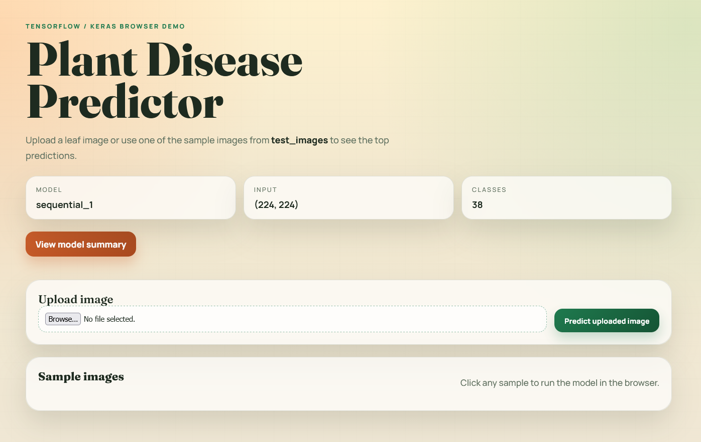
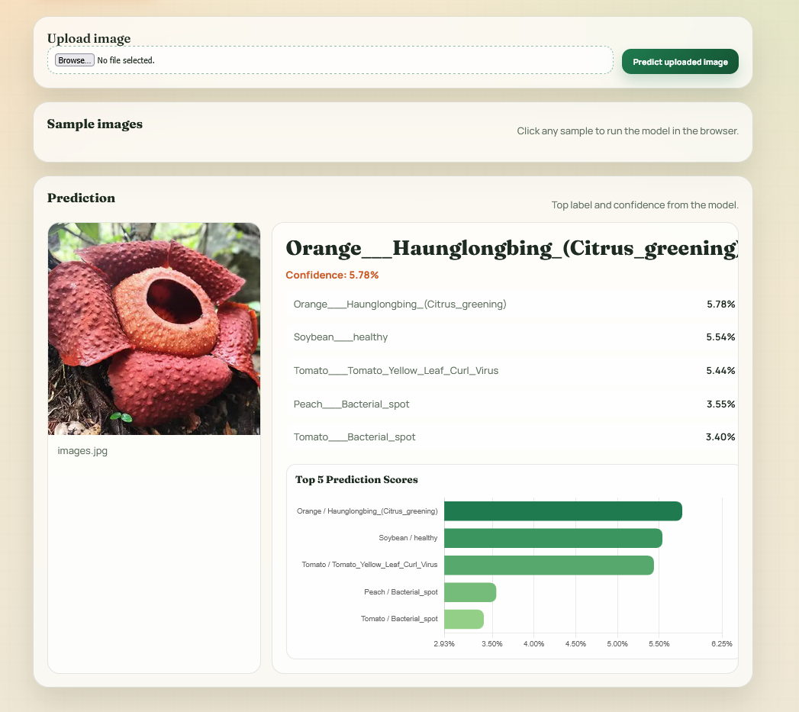
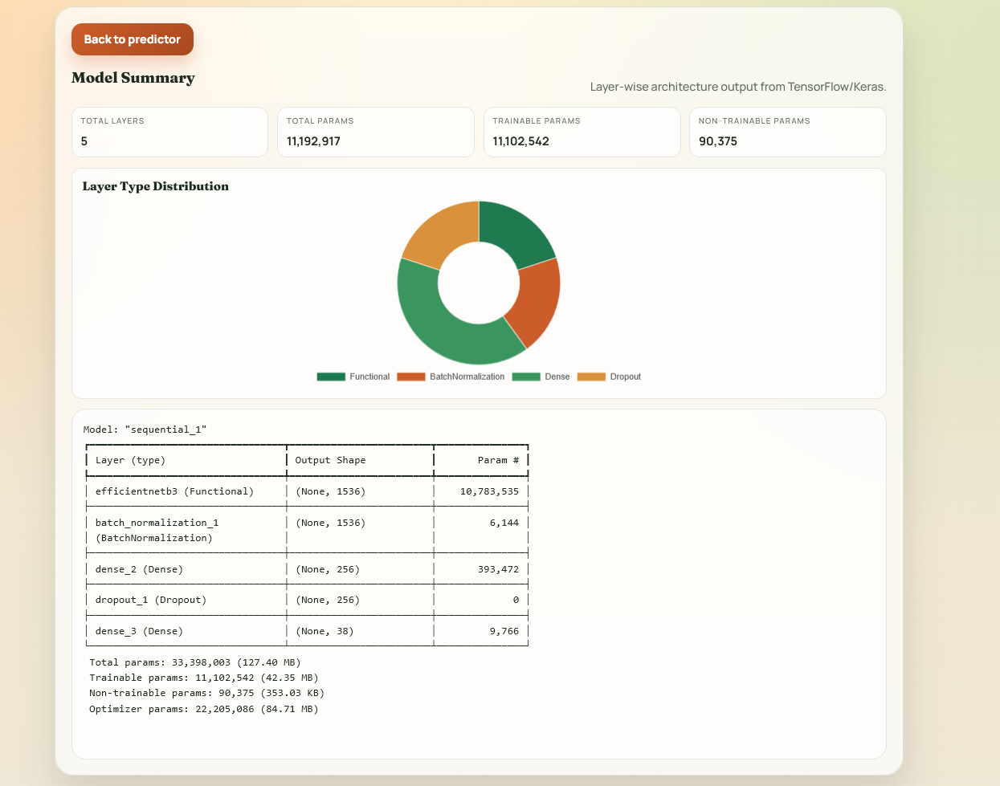

# Plant Disease Prediction

A deep learning application for predicting plant diseases from leaf images using a trained TensorFlow/Keras neural network model. The application supports both a web interface and a command-line interface.

## Features

- **38-Class Disease Classification**: Recognizes 38 different plant diseases across multiple plant types
- **Web Interface**: User-friendly Flask web application with intuitive UI
- **Dockerized Deployment**: Easy deployment with Docker support
- **CLI Support**: Command-line interface for batch predictions
- **Real-time Predictions**: Quick inference with Keras models
- **Pre-trained Models**: Includes pre-trained models (`model_epoch_07.keras`, `model_epoch_13.keras`)
- **Sample Test Images**: Built-in test images for quick evaluation

## Supported Plant Diseases

The model can detect diseases in the following plants:
- Apple (scab, black rot, cedar apple rust, healthy)
- Blueberry
- Cherry (powdery mildew, healthy)
- Corn/Maize (cercospora leaf spot, common rust, northern leaf blight, healthy)
- Grape (black rot, esca, leaf blight, healthy)
- Orange (citrus greening)
- Peach (bacterial spot, healthy)
- Bell Pepper (bacterial spot, healthy)
- Potato (early blight, late blight, healthy)
- Raspberry
- Soybean
- Squash (powdery mildew)
- Strawberry (leaf scorch, healthy)
- Tomato (8 different diseases + healthy)

## Installation

### Prerequisites
- Python 3.8+
- pip or conda package manager
- Docker (optional, for containerized deployment)

### Setup

1. **Clone the repository**
   ```bash
   git clone <repository-url>
   cd plant_disease_prediction
   ```

2. **Create a virtual environment (recommended)**
   ```bash
   python -m venv venv
   source venv/bin/activate  # On Windows: venv\Scripts\activate
   ```

3. **Install dependencies**
   ```bash
   pip install -r requirements.txt
   ```

4. **Ensure model file exists**
   ```bash
   # Default model: model_epoch_07.keras
   # Fallback models: model_epoch_13.keras
   ```

## Usage

### Web Interface

Start the Flask web application:

```bash
python app.py
```

The application will be available at `http://localhost:5000`

#### Home Page
Upload a plant leaf image to get disease predictions.

**Screenshot - Home Page:**
```

```

#### Predict Page
View real-time predictions and model confidence scores.

**Screenshot - Predict Page:**
```

```

#### Summary Page
Review prediction history and statistics.

**Screenshot - Summary Page:**
```

```

## Project Structure

```
plant_disease_prediction/
├── app.py                      # Flask web application
├── tmp.py                      # CLI tool for predictions
├── cli_app.ipynb              # Jupyter notebook for interactive use
├── model_epoch_07.keras       # Pre-trained model (38 classes)
├── model_epoch_13.keras       # Alternative pre-trained model
├── requirements.txt           # Python dependencies
├── Dockerfile                 # Docker configuration
├── static/
│   └── style.css             # Web interface styling
├── templates/
│   ├── index.html            # Home page template
│   └── summary.html          # Summary page template
├── test_images/              # Sample images for testing
└── pics/                     # Additional image directory
```

## Dependencies

- **Flask** 3.1.0 - Web framework
- **TensorFlow** 2.21.0 - Deep learning framework
- **NumPy** 2.4.4 - Numerical computing
- **Pillow** 11.2.1 - Image processing
- **Gunicorn** 23.0.0 - WSGI HTTP Server

## Docker Deployment

### Build Docker Image
```bash
docker build -t plant-disease-prediction .
```

### Run Container
```bash
docker run -p 5000:5000 plant-disease-prediction
```

## Model Information

- **Architecture**: Convolutional Neural Network (CNN)
- **Framework**: TensorFlow/Keras
- **Output Classes**: 38 plant disease categories
- **Training Data**: PlantVillage dataset

## API Usage (Flask)

### Predict Endpoint
```bash
POST /predict
Content-Type: multipart/form-data

# Submit image file
curl -X POST -F "file=@path/to/image.jpg" http://localhost:5000/predict
```

## Notes

- The application uses the PlantVillage dataset label order for consistent predictions
- When making predictions via the `/predict` endpoint, the uploaded file stream is handled efficiently to avoid reading it multiple times
- Test images are available in the `test_images/` directory for quick evaluation without uploading custom images


## Troubleshooting

### Model Not Found
Ensure `model_epoch_07.keras` exists in the project root. If using a different model name, update the `MODEL_FILENAME` variable.

### Port Already in Use
If port 5000 is in use, modify the Flask app or use environment variables to specify a different port.

### Import Errors
Ensure all dependencies from `requirements.txt` are installed:
```bash
pip install --upgrade -r requirements.txt
```
